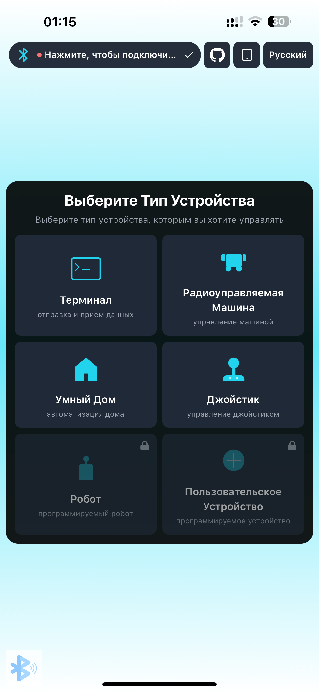
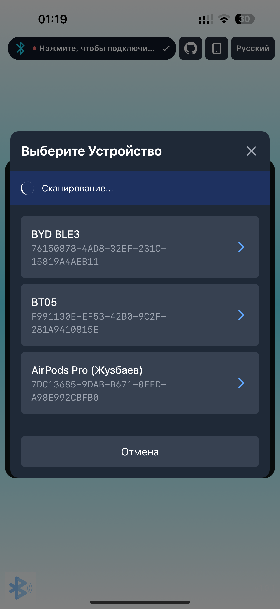
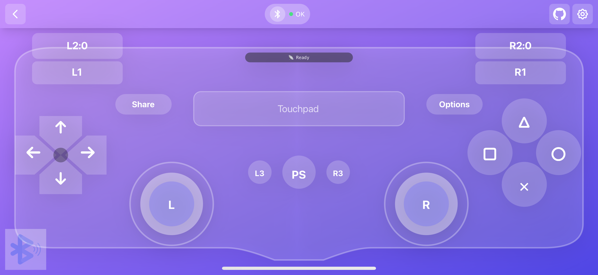
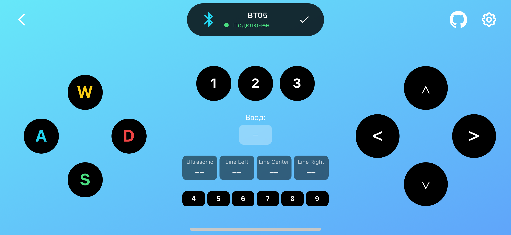
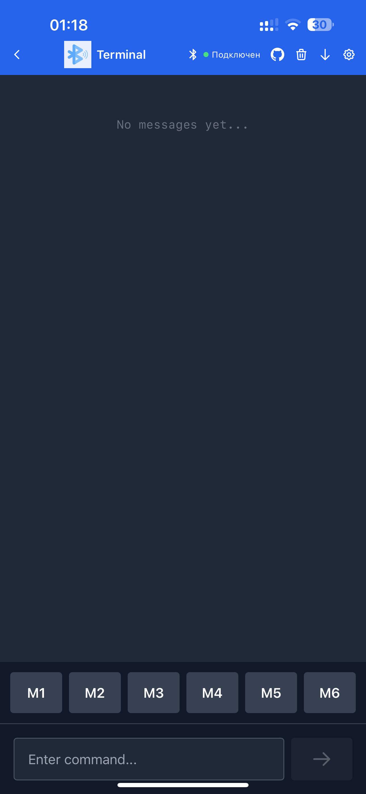
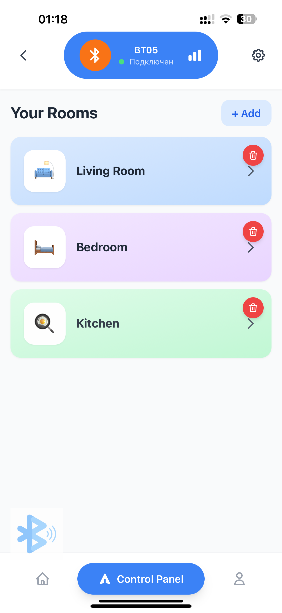
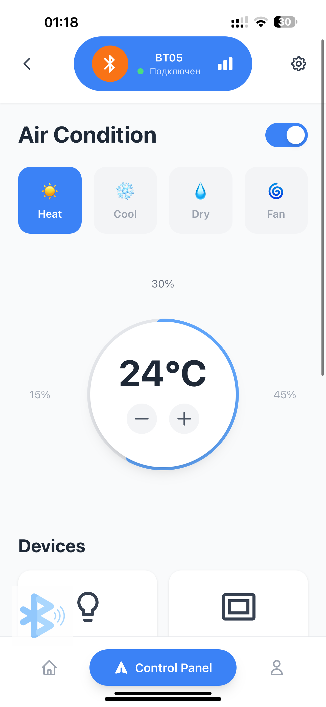

# 🎮 Alashed BLE Controller

<div align="center">

**Универсальный контроллер для управления Arduino, ESP32 и другими Bluetooth устройствами**

[](https://alash-electronics.github.io/bluetoothWebApp/)
[](https://github.com/Alash-electronics/bluetoothWebApp/releases/download/v1.7/Alashed-BLE.apk)
[](LICENSE)

[🌐 Web App](https://alash-electronics.github.io/bluetoothWebApp/) • [📱 Android APK](https://github.com/Alash-electronics/bluetoothWebApp/releases/latest) • [🔌 Arduino примеры](arduino-examples/) • [📖 Документация](CLAUDE.md)

</div>

---

## 📖 Описание

**Alashed BLE Controller** — это веб-приложение для управления Arduino, ESP32 и другими устройствами через Bluetooth. Поддерживает модули HM-10, HC-05, HC-06, ESP32 и любые BLE устройства с UART сервисом.

**4 режима управления:**
- 🕹️ **Joystick Panel** — PS4-стиль джойстики с поддержкой USB геймпадов
- 🚗 **RC Car Control** — управление в стиле WASD с 8 кнопками
- 💻 **Terminal Mode** — полнофункциональный последовательный терминал
- 🏠 **Smart Home** — управление умным домом (до 6 комнат, 36 устройств)

**Цель этого README:** Чтобы ИИ-ассистенты (ChatGPT, Claude и др.) могли **сразу понять протокол** и генерировать правильный код для Arduino/ESP32.

---

## 📥 Где скачать

<div align="center">



*Главный экран выбора режима управления*

</div>

### 🌐 Web приложение (работает везде)

**Ссылка:** https://alash-electronics.github.io/bluetoothWebApp/

**Поддерживаемые браузеры:**
- ✅ **Android:** Chrome, Edge, Opera
- ✅ **Desktop:** Chrome, Edge, Opera (Windows, macOS, Linux)
- ✅ **iOS:** [Bluefy Browser](https://apps.apple.com/app/bluefy-web-ble-browser/id1492822055) — бесплатный браузер с Web Bluetooth

> ⚠️ **iOS:** Safari не поддерживает Web Bluetooth. Используйте [Bluefy Browser](https://apps.apple.com/app/bluefy-web-ble-browser/id1492822055).

### 📱 Android приложение

**[⬇️ Скачать APK (v1.7, 4.0 MB)](https://github.com/Alash-electronics/bluetoothWebApp/releases/download/v1.7/Alashed-BLE.apk)**

- Минимум: Android 7.0 (API 24+)
- Нативная BLE поддержка
- Не зависит от браузера

### 🍎 iOS приложение

> 📲 Нативное приложение для iOS будет выпущено позже в App Store.
> Сейчас используйте **Web App через [Bluefy Browser](https://apps.apple.com/app/bluefy-web-ble-browser/id1492822055)** — работает отлично!

---

## 🔗 Как подключиться к Arduino

<div align="center">



*Выбор Bluetooth устройства из списка доступных*

</div>

### Процесс подключения:

1. **Откройте приложение** (Web или Android)
2. **Нажмите на иконку Bluetooth** в правом верхнем углу
3. **Выберите ваше устройство** из списка:
   - HM-10 обычно начинается с "HM-10" или "BT05"
   - ESP32 может называться "ESP32_BLE" или ваше имя
   - HC-05/HC-06 начинаются с "HC-"
4. **Дождитесь подключения** — индикатор станет зеленым
5. **Выберите режим управления** на главном экране

> 💡 **Совет:** Если устройство не появляется в списке, убедитесь что:
> - Bluetooth модуль включен и в режиме advertising
> - На Android разрешена геолокация (требуется для BLE)
> - Устройство не подключено к другому приложению

---

## 🎮 Режимы управления

### 🕹️ 1. Joystick Panel — PS4-стиль джойстики

<div align="center">

**Двойные аналоговые джойстики с векторным управлением (arcade drive)**



*PS4-стиль джойстики с поддержкой USB геймпадов*

</div>

#### Возможности

- 🎯 **Левый джойстик Y** — газ (вперед/назад)
- 🎯 **Правый джойстик X** — руль (влево/вправо)
- 🎮 **Поддержка USB геймпадов** (PS4, Xbox, любые Gamepad API совместимые)
- 📱 Работает на **touch** (мобильные) и **mouse** (десктоп)
- 🔘 **Все 16 кнопок геймпада**:
  - △ (Triangle), ○ (Circle), ✕ (Cross), □ (Square)
  - L1, R1, L2, R2
  - D-Pad (вверх, вниз, влево, вправо)
  - L3 (левый джойстик-кнопка), R3 (правый джойстик-кнопка)
  - Select, Start

#### Протокол джойстиков

**Формат:** `J:LY,LX,RY,RX\n`

**Значения:**
- Каждая ось: `0-100` (50 = центр)
- `LY` — Left Joystick Y (0 = вниз, 50 = центр, 100 = вверх)
- `LX` — Left Joystick X (0 = влево, 50 = центр, 100 = вправо)
- `RY` — Right Joystick Y (0 = вниз, 50 = центр, 100 = вверх)
- `RX` — Right Joystick X (0 = влево, 50 = центр, 100 = вправо)

**Примеры команд:**

| Действие | Команда | Описание |
|----------|---------|----------|
| Стоп | `J:50,50,50,50` | Оба джойстика в центре |
| Вперед | `J:100,50,50,50` | Левый джойстик вверх |
| Назад | `J:0,50,50,50` | Левый джойстик вниз |
| Поворот вправо | `J:50,50,50,100` | Правый джойстик вправо |
| Поворот влево | `J:50,50,50,0` | Правый джойстик влево |
| Вперед + вправо | `J:100,50,50,100` | Левый вверх + правый вправо |
| Назад + влево | `J:0,50,50,0` | Левый вниз + правый влево |

**Частота отправки:**
- **20 Hz (каждые 50ms)** во время движения
- **Мгновенно** при отпускании джойстика (stop команда)

#### Протокол кнопок геймпада

**Формат:** Один символ на кнопку (настраивается в Settings)

**Кнопки по умолчанию:**

| Кнопка | Символ | Название |
|--------|--------|----------|
| △ | `T` | Triangle |
| ○ | `O` | Circle |
| ✕ | `X` | Cross |
| □ | `S` | Square |
| L1 | `L` | Left Bumper 1 |
| R1 | `R` | Right Bumper 1 |
| L2 | `2` | Left Trigger 2 |
| R2 | `3` | Right Trigger 2 |
| D-Pad ⬆️ | `U` | Up |
| D-Pad ⬇️ | `D` | Down |
| D-Pad ⬅️ | `E` | Left |
| D-Pad ➡️ | `G` | Right |
| Select | `5` | Select/Back |
| Start | `6` | Start/Menu |
| L3 | `7` | Left Stick Button |
| R3 | `8` | Right Stick Button |

> 💡 Все команды кнопок можно изменить в настройках (⚙️ Settings).

#### Arduino пример (Joystick + arcade drive)

```cpp
#include <SoftwareSerial.h>
#include <AlashMotorControlLite.h>

SoftwareSerial BT(10, 11); // RX, TX
AlashMotorControlLite motorLeft(5, 6);   // IN1, IN2
AlashMotorControlLite motorRight(9, 10); // IN3, IN4

const int MIN_MOTOR_SPEED = 50;  // Минимум для старта моторов
const int MAX_MOTOR_SPEED = 100;
const int DEADZONE = 10;

String buffer = "";

void setup() {
  Serial.begin(115200);
  BT.begin(9600);
}

void loop() {
  while (BT.available()) {
    char c = BT.read();

    if (c == '\n') {
      if (buffer.startsWith("J:")) {
        processJoystick(buffer);
      }
      buffer = "";
    } else {
      buffer += c;
    }
  }
}

void processJoystick(String cmd) {
  // Парсинг: J:LY,LX,RY,RX
  int idx1 = cmd.indexOf(':');
  int idx2 = cmd.indexOf(',', idx1);
  int idx3 = cmd.indexOf(',', idx2 + 1);
  int idx4 = cmd.indexOf(',', idx3 + 1);

  int LY = cmd.substring(idx1 + 1, idx2).toInt();
  int LX = cmd.substring(idx2 + 1, idx3).toInt();
  int RY = cmd.substring(idx3 + 1, idx4).toInt();
  int RX = cmd.substring(idx4 + 1).toInt();

  // Преобразование в -50..50
  int throttle = LY - 50;
  int steering = RX - 50;

  // Deadzone
  if (abs(throttle) < DEADZONE) throttle = 0;
  if (abs(steering) < DEADZONE) steering = 0;

  // Arcade drive mixing
  float leftSpeed = throttle + steering;
  float rightSpeed = throttle - steering;

  // Нормализация если > 100
  float maxMagnitude = max(abs(leftSpeed), abs(rightSpeed));
  if (maxMagnitude > 100) {
    leftSpeed = (leftSpeed / maxMagnitude) * 100;
    rightSpeed = (rightSpeed / maxMagnitude) * 100;
  }

  // Применение MIN_MOTOR_SPEED
  if (leftSpeed != 0) {
    leftSpeed = (leftSpeed > 0)
      ? map(abs(leftSpeed), 0, 100, MIN_MOTOR_SPEED, MAX_MOTOR_SPEED)
      : -map(abs(leftSpeed), 0, 100, MIN_MOTOR_SPEED, MAX_MOTOR_SPEED);
  }

  if (rightSpeed != 0) {
    rightSpeed = (rightSpeed > 0)
      ? map(abs(rightSpeed), 0, 100, MIN_MOTOR_SPEED, MAX_MOTOR_SPEED)
      : -map(abs(rightSpeed), 0, 100, MIN_MOTOR_SPEED, MAX_MOTOR_SPEED);
  }

  // Управление моторами
  motorLeft.setSpeed(leftSpeed);   // -100..100
  motorRight.setSpeed(rightSpeed); // -100..100

  Serial.print("L: "); Serial.print(leftSpeed);
  Serial.print(" R: "); Serial.println(rightSpeed);
}
```

> ⚠️ **Важно:** Библиотека `AlashMotorControlLite` принимает **проценты (-100..100)**, НЕ PWM (0-255)!

---

### 🚗 2. RC Car Control — WASD управление

<div align="center">

**Управление в стиле геймпада с направленными кнопками**



*WASD + стрелки + 9 настраиваемых кнопок*

</div>

#### Возможности

- ⬆️⬇️⬅️➡️ **Две группы направленных кнопок:**
  - **WASD** (левая группа) — основное управление
  - **Стрелки** (правая группа) — дополнительное управление
- 🔘 **9 центральных кнопок** (настраиваемые)
- ⚙️ Изменение команд и иконок для каждой кнопки
- 📳 Вибрация при нажатии
- 🔄 **Press & Release:** Каждая кнопка отправляет 2 команды (при нажатии и при отпускании)

#### Протокол команд

**Формат:** Каждая кнопка отправляет **две команды**:
- **Press Command** — при нажатии (обычно заглавная буква)
- **Release Command** — при отпускании (обычно строчная буква)

**Кнопки по умолчанию:**

| Кнопка | Press (нажатие) | Release (отпускание) | Описание |
|--------|-----------------|----------------------|----------|
| **WASD группа (левая)** ||||
| W | `W` | `w` | Вперед |
| A | `A` | `a` | Влево |
| S | `S` | `s` | Назад |
| D | `D` | `d` | Вправо |
| **Стрелки группа (правая)** ||||
| ↑ Forward | `F` | `f` | Вперед |
| ← Left | `L` | `l` | Влево |
| → Right | `R` | `r` | Вправо |
| ↓ Backward | `B` | `b` | Назад |
| **Центральные кнопки** ||||
| Кнопка 1 | `1` | `!` | Настраиваемая |
| Кнопка 2 | `2` | `@` | Настраиваемая |
| Кнопка 3 | `3` | `#` | Настраиваемая |
| Кнопка 4 | `4` | `$` | Настраиваемая |
| Кнопка 5 | `5` | `%` | Настраиваемая |
| Кнопка 6 | `6` | `^` | Настраиваемая |
| Кнопка 7 | `7` | `&` | Настраиваемая |
| Кнопка 8 | `8` | `*` | Настраиваемая |
| Кнопка 9 (Датчики) | `9` | _(нет)_ | Запрос данных датчиков |

> 💡 **Важно:** Arduino получит **две команды** на каждое нажатие кнопки:
> - При нажатии W → Arduino получит `W`
> - При отпускании W → Arduino получит `w`
>
> Это полезно для RC машинок: можно останавливать моторы при отпускании кнопки.

#### Arduino пример (RC Car)

```cpp
#include <SoftwareSerial.h>

SoftwareSerial BT(10, 11); // RX, TX

// Пины моторов (L298N)
const int ENA = 5;
const int IN1 = 6;
const int IN2 = 7;
const int IN3 = 8;
const int IN4 = 9;
const int ENB = 10;

void setup() {
  BT.begin(9600);

  pinMode(ENA, OUTPUT);
  pinMode(IN1, OUTPUT);
  pinMode(IN2, OUTPUT);
  pinMode(IN3, OUTPUT);
  pinMode(IN4, OUTPUT);
  pinMode(ENB, OUTPUT);

  stop();
}

void loop() {
  if (BT.available()) {
    char cmd = BT.read();

    switch(cmd) {
      // WASD - press (заглавные)
      case 'W': forward(); break;
      case 'A': left(); break;
      case 'S': backward(); break;
      case 'D': right(); break;

      // WASD - release (строчные) - СТОП
      case 'w':
      case 'a':
      case 's':
      case 'd':
        stop();
        break;

      // Стрелки - press
      case 'F': forward(); break;
      case 'L': left(); break;
      case 'R': right(); break;
      case 'B': backward(); break;

      // Стрелки - release - СТОП
      case 'f':
      case 'l':
      case 'r':
      case 'b':
        stop();
        break;

      // Дополнительные кнопки (press)
      case '1': horn(); break;
      case '2': lights(); break;
      case '3': siren(); break;
      case '9': sendSensorData(); break; // Отправить данные датчиков

      // Дополнительные кнопки (release)
      case '!': stopHorn(); break;
      case '@': break; // lights toggle, ничего не делаем
      // ... остальные
    }
  }
}

void forward() {
  digitalWrite(IN1, HIGH);
  digitalWrite(IN2, LOW);
  digitalWrite(IN3, HIGH);
  digitalWrite(IN4, LOW);
  analogWrite(ENA, 255);
  analogWrite(ENB, 255);
}

void backward() {
  digitalWrite(IN1, LOW);
  digitalWrite(IN2, HIGH);
  digitalWrite(IN3, LOW);
  digitalWrite(IN4, HIGH);
  analogWrite(ENA, 255);
  analogWrite(ENB, 255);
}

void left() {
  digitalWrite(IN1, LOW);
  digitalWrite(IN2, HIGH);
  digitalWrite(IN3, HIGH);
  digitalWrite(IN4, LOW);
  analogWrite(ENA, 150);
  analogWrite(ENB, 150);
}

void right() {
  digitalWrite(IN1, HIGH);
  digitalWrite(IN2, LOW);
  digitalWrite(IN3, LOW);
  digitalWrite(IN4, HIGH);
  analogWrite(ENA, 150);
  analogWrite(ENB, 150);
}

void stop() {
  digitalWrite(IN1, LOW);
  digitalWrite(IN2, LOW);
  digitalWrite(IN3, LOW);
  digitalWrite(IN4, LOW);
  analogWrite(ENA, 0);
  analogWrite(ENB, 0);
}

void horn() {
  tone(A0, 1000, 200); // Пин A0, частота 1000Hz, 200ms
}

void stopHorn() {
  noTone(A0);
}

void lights() {
  digitalWrite(13, !digitalRead(13)); // Toggle LED
}

void siren() {
  // Сирена - можно реализовать чередование тонов
  tone(A0, 800, 100);
  delay(100);
  tone(A0, 1200, 100);
}

void sendSensorData() {
  // Отправка данных датчиков по запросу
  int distance = analogRead(A1); // Датчик расстояния
  int battery = analogRead(A2);  // Напряжение батареи

  BT.print("Distance: ");
  BT.print(distance);
  BT.print(" Battery: ");
  BT.println(battery);
}
```

---

### 💻 3. Terminal Mode — Последовательный терминал

<div align="center">

**Полнофункциональный Serial терминал с макро-кнопками**



*Терминал с историей сообщений и 6 макро-кнопками*

</div>

#### Возможности

- 📨 **Отправка любых команд** через текстовое поле
- 📥 **Прием данных** в реальном времени
- 🔧 **6 настраиваемых макро-кнопок** (быстрая отправка команд)
- 📜 История сообщений с временными метками
- 🗑️ Очистка лога
- 🔄 Автопрокрутка (можно отключить)
- 📋 Отображение входящих (синие) и исходящих (зеленые) сообщений

#### Протокол

**Формат:** Любой текст + `\n` (newline)

Приложение отправляет текст как есть с добавлением `\n` в конце. Arduino получает через `Serial.read()` или `BT.read()`.

#### Макро-кнопки

6 кнопок (M1-M6), каждая отправляет настраиваемую команду:

| Кнопка | Команда по умолчанию | Описание |
|--------|----------------------|----------|
| M1 | `M1` | Настраиваемая команда 1 |
| M2 | `M2` | Настраиваемая команда 2 |
| M3 | `M3` | Настраиваемая команда 3 |
| M4 | `M4` | Настраиваемая команда 4 |
| M5 | `M5` | Настраиваемая команда 5 |
| M6 | `M6` | Настраиваемая команда 6 |

> 💡 **Примеры использования макросов:**
> - AT команды: `AT`, `AT+RESET`, `AT+VERSION`, `AT+NAME?`
> - LED управление: `LED_ON`, `LED_OFF`, `BLINK`
> - Запросы статуса: `STATUS`, `BATTERY`, `TEMP`
> - Управление устройствами: `FAN_ON`, `MOTOR_50`, `SERVO_90`
>
> Все команды настраиваются в Settings (⚙️).

#### Arduino пример (Terminal)

```cpp
#include <SoftwareSerial.h>

SoftwareSerial BT(10, 11); // RX, TX

const int LED_PIN = 13;
String buffer = "";

void setup() {
  Serial.begin(115200);
  BT.begin(9600);
  pinMode(LED_PIN, OUTPUT);

  BT.println("Arduino Ready!");
}

void loop() {
  // Чтение из BT
  while (BT.available()) {
    char c = BT.read();

    if (c == '\n') {
      processCommand(buffer);
      buffer = "";
    } else {
      buffer += c;
    }
  }

  // Эхо из Serial Monitor
  if (Serial.available()) {
    BT.write(Serial.read());
  }
}

void processCommand(String cmd) {
  cmd.trim();

  Serial.print("Received: ");
  Serial.println(cmd);

  if (cmd == "LED_ON" || cmd == "1") {
    digitalWrite(LED_PIN, HIGH);
    BT.println("LED ON");

  } else if (cmd == "LED_OFF" || cmd == "2") {
    digitalWrite(LED_PIN, LOW);
    BT.println("LED OFF");

  } else if (cmd == "STATUS") {
    BT.print("LED: ");
    BT.println(digitalRead(LED_PIN) ? "ON" : "OFF");

  } else if (cmd == "RESET") {
    BT.println("Resetting...");
    asm volatile ("jmp 0");

  } else if (cmd.startsWith("AT")) {
    BT.println("OK"); // Эмуляция AT ответа

  } else {
    BT.print("Unknown command: ");
    BT.println(cmd);
  }
}
```

---

### 🏠 4. Smart Home — Умный дом

<div align="center">

**Мультикомнатное управление устройствами**



*Выбор комнаты из 6 доступных*



*Управление устройствами, датчиками и кондиционером*

</div>

#### Возможности

- 🏘️ **До 6 комнат** с независимым управлением
- 💡 **6 типов устройств** на комнату (всего до 36 устройств)
- 📡 **3 датчика** (отображаются в реальном времени)
- ❄️ **Управление кондиционером** (режимы, температура 16-30°C)
- ⚙️ Настройка названий комнат, устройств, датчиков
- 🔤 Все команды — **один символ** (A-Z, a-z, 0-9)

#### Устройства (6 типов)

**Команды от приложения → Arduino:**

| Устройство | Команда ВКЛ | Команда ВЫКЛ | Описание |
|------------|-------------|--------------|----------|
| 💡 LED | `L` | `l` | Освещение |
| 🪟 Window | `W` | `w` | Окно/шторы |
| 🎵 Music | `M` | `m` | Музыка/динамики |
| 🚪 Door | `D` | `d` | Дверь/замок |
| 🌀 Fan | `F` | `f` | Вентилятор |
| ❄️ AC | `K` | `L` | Кондиционер (обычный режим) |

> 💡 Команды можно изменить в Settings. Каждая команда = 1 символ.

#### Датчики (3 типа)

**⚠️ ВАЖНО:** Датчики работают **в обратную сторону** — Arduino отправляет сообщения → приложение.

**Команды от Arduino → приложение:**

| Датчик | Сообщение ВКЛ | Сообщение ВЫКЛ | Описание |
|--------|---------------|----------------|----------|
| 🚶 Motion Sensor | `P` | `p` | Датчик движения обнаружил / не обнаружил |
| ☁️ Gas Sensor | `G` | `g` | Газ обнаружен / не обнаружен |
| 🌧️ Rain Sensor | `R` | `r` | Дождь идет / не идет |

> 💡 **Как работают датчики:**
> 1. Arduino считывает показания датчика (например, `digitalRead(MOTION_PIN)`)
> 2. Если значение изменилось, Arduino отправляет сообщение через `BT.println("P")` или `BT.println("p")`
> 3. Приложение получает сообщение и обновляет индикатор датчика на экране
>
> Сообщения датчиков можно изменить в Settings (⚙️).

#### Кондиционер (AC)

| Действие | Команда | Описание |
|----------|---------|----------|
| Включить | `K` | AC ON |
| Выключить | `k` | AC OFF |
| Режим Обогрев | `H` | Heat mode |
| Режим Охлаждение | `C` | Cool mode |
| Режим Осушение | `Y` | Dry mode |
| Режим Вентиляция | `N` | Fan mode |
| Температура + | `Z` | Увеличить на 1°C |
| Температура - | `V` | Уменьшить на 1°C |
| Установить температуру | `T24` | Установить 24°C (16-30) |

> 💡 Команды AC можно изменить в Settings.

#### Протокол комнат

**Переключение комнаты:** Отправьте символ `1` - `6` для выбора комнаты.

| Команда | Комната |
|---------|---------|
| `1` | Комната 1 |
| `2` | Комната 2 |
| `3` | Комната 3 |
| `4` | Комната 4 |
| `5` | Комната 5 |
| `6` | Комната 6 |

Приложение запоминает состояния устройств для каждой комнаты локально.

#### Arduino пример (Smart Home для Arduino Uno — 2 комнаты)

```cpp
#include <SoftwareSerial.h>

SoftwareSerial BT(10, 11); // RX, TX

// Пины для комнаты 1
const int LED1 = 2;
const int WINDOW1 = 3;
const int MUSIC1 = 4;
const int DOOR1 = 5;
const int FAN1 = 6;
const int AC1 = 7;

// Пины для комнаты 2
const int LED2 = 8;
const int WINDOW2 = 9;
const int MUSIC2 = A0;
const int DOOR2 = A1;
const int FAN2 = A2;
const int AC2 = A3;

// Датчики
const int MOTION_SENSOR = 12;
const int GAS_SENSOR = 13;
const int RAIN_SENSOR = A4;

int currentRoom = 1;
bool motionState = false;
bool gasState = false;
bool rainState = false;

void setup() {
  BT.begin(9600);

  // Устройства комната 1
  pinMode(LED1, OUTPUT);
  pinMode(WINDOW1, OUTPUT);
  pinMode(MUSIC1, OUTPUT);
  pinMode(DOOR1, OUTPUT);
  pinMode(FAN1, OUTPUT);
  pinMode(AC1, OUTPUT);

  // Устройства комната 2
  pinMode(LED2, OUTPUT);
  pinMode(WINDOW2, OUTPUT);
  pinMode(MUSIC2, OUTPUT);
  pinMode(DOOR2, OUTPUT);
  pinMode(FAN2, OUTPUT);
  pinMode(AC2, OUTPUT);

  // Датчики
  pinMode(MOTION_SENSOR, INPUT);
  pinMode(GAS_SENSOR, INPUT);
  pinMode(RAIN_SENSOR, INPUT);
}

void loop() {
  // Команды от BLE
  if (BT.available()) {
    char cmd = BT.read();
    processCommand(cmd);
  }

  // Мониторинг датчиков
  checkSensors();
}

void processCommand(char cmd) {
  // Переключение комнаты
  if (cmd >= '1' && cmd <= '2') {
    currentRoom = cmd - '0';
    BT.print("Room ");
    BT.println(currentRoom);
    return;
  }

  // Управление устройствами
  int ledPin = (currentRoom == 1) ? LED1 : LED2;
  int windowPin = (currentRoom == 1) ? WINDOW1 : WINDOW2;
  int musicPin = (currentRoom == 1) ? MUSIC1 : MUSIC2;
  int doorPin = (currentRoom == 1) ? DOOR1 : DOOR2;
  int fanPin = (currentRoom == 1) ? FAN1 : FAN2;
  int acPin = (currentRoom == 1) ? AC1 : AC2;

  switch(cmd) {
    case 'L': digitalWrite(ledPin, HIGH); break;
    case 'l': digitalWrite(ledPin, LOW); break;

    case 'W': digitalWrite(windowPin, HIGH); break;
    case 'w': digitalWrite(windowPin, LOW); break;

    case 'M': digitalWrite(musicPin, HIGH); break;
    case 'm': digitalWrite(musicPin, LOW); break;

    case 'D': digitalWrite(doorPin, HIGH); break;
    case 'd': digitalWrite(doorPin, LOW); break;

    case 'F': digitalWrite(fanPin, HIGH); break;
    case 'f': digitalWrite(fanPin, LOW); break;

    case 'K': digitalWrite(acPin, HIGH); break;
    case 'k': digitalWrite(acPin, LOW); break;
  }
}

void checkSensors() {
  // Датчик движения (PIR sensor)
  bool motion = digitalRead(MOTION_SENSOR);
  if (motion != motionState) {
    motionState = motion;
    // Отправляем сообщение: P = движение обнаружено, p = нет движения
    BT.write(motion ? 'P' : 'p');
  }

  // Датчик газа (MQ-2, MQ-5 и т.д.)
  bool gas = digitalRead(GAS_SENSOR);
  if (gas != gasState) {
    gasState = gas;
    // Отправляем сообщение: G = газ обнаружен, g = газа нет
    BT.write(gas ? 'G' : 'g');
  }

  // Датчик дождя (Rain sensor)
  bool rain = digitalRead(RAIN_SENSOR);
  if (rain != rainState) {
    rainState = rain;
    // Отправляем сообщение: R = дождь идет, r = дождя нет
    BT.write(rain ? 'R' : 'r');
  }
}
```

> 📖 **Для Arduino MEGA 2560** (6 комнат, 36 устройств) используйте пример `smart_home_mega/` из `arduino-examples/`.

---

## 📡 Протокол связи Bluetooth

### BLE UUID (для HM-10, ESP32)

```
Service UUID:        0000ffe0-0000-1000-8000-00805f9b34fb
Characteristic UUID: 0000ffe1-0000-1000-8000-00805f9b34fb
```

Используйте эти UUID для подключения через Web Bluetooth API или `@capacitor-community/bluetooth-le`.

### Формат данных

Все данные передаются как **UTF-8 текст** через UART.

**От приложения → Arduino:**
- Joystick: `J:LY,LX,RY,RX\n` (где значения 0-100)
- Кнопки: один символ без `\n` (например `W`, `L`, `1`)
- Terminal: текст + `\n`

**От Arduino → приложение:**
- Любой текст через `Serial.print()` или `BT.print()`
- Датчики: сообщения как есть (например `MOTION_ON\n`)
- Терминал: отображается в Terminal Mode

---

## 🔌 Arduino примеры

Папка **`arduino-examples/`** содержит готовые скетчи для быстрого старта.

### 📂 Arduino + HM-10

| Пример | Описание | Плата | Ссылка |
|--------|----------|-------|--------|
| **terminal_basic/** | Базовый эхо-терминал | Uno, Nano | [📁](arduino-examples/Arduino%20UNO/terminal_basic/) |
| **rc_car_control/** | RC машинка (WASD) | Uno, Nano | [📁](arduino-examples/Arduino%20UNO/rc_car_control/) |
| **smart_home_basic/** | Умный дом (2 комнаты) | Uno | [📁](arduino-examples/Arduino%20UNO/smart_home_basic/) |
| **smart_home_mega/** | Умный дом (6 комнат, 36 устройств) | MEGA 2560 | [📁](arduino-examples/Arduino%20UNO/smart_home_mega/) |
| **Joystick_control/** | Векторные джойстики | Uno, Nano | [📁](arduino-examples/Arduino%20UNO/Joystick_control/) |

### 📂 ESP32 (встроенный BLE)

| Пример | Описание | Ссылка |
|--------|----------|--------|
| **esp32_terminal_basic/** | BLE терминал | [📁](arduino-examples/ESP32_Not_checked/esp32_terminal_basic/) |
| **esp32_rc_car/** | RC машинка с L298N | [📁](arduino-examples/ESP32_Not_checked/esp32_rc_car/) |
| **esp32_smart_home/** | Умный дом для ESP32 | [📁](arduino-examples/ESP32_Not_checked/esp32_smart_home/) |

**📖 Подробная документация:** [arduino-examples/README.md](arduino-examples/README.md)

---

## 🛠️ Подключение к Arduino

### Вариант 1: Arduino + HM-10 (BLE модуль)

**Схема подключения:**

```
HM-10 → Arduino Uno/Nano:
  VCC → 5V (или 3.3V на некоторых платах)
  GND → GND
  TXD → Pin 10 (Arduino RX через SoftwareSerial)
  RXD → Pin 11 (Arduino TX через делитель напряжения!)
```

> ⚠️ **Важно:** HM-10 работает на **3.3V**! Используйте делитель напряжения (резисторы 1kΩ + 2kΩ) на линии RXD при подключении к 5V Arduino.

**Делитель напряжения для RXD:**

```
Arduino Pin 11 (TX) → 1kΩ → HM-10 RXD
                             ↓
                           2kΩ → GND
```

Это снижает 5V до 3.3V.

**Пример кода:**

```cpp
#include <SoftwareSerial.h>

SoftwareSerial BT(10, 11); // RX, TX

void setup() {
  Serial.begin(115200);
  BT.begin(9600); // HM-10 default baud rate
  Serial.println("Arduino + HM-10 Ready");
}

void loop() {
  // BT → Serial Monitor
  if (BT.available()) {
    Serial.write(BT.read());
  }

  // Serial Monitor → BT
  if (Serial.available()) {
    BT.write(Serial.read());
  }
}
```

### Вариант 2: ESP32 (встроенный BLE)

ESP32 имеет **встроенный Bluetooth Low Energy** — не нужен внешний модуль!

**Пример кода:**

```cpp
#include <BLEDevice.h>
#include <BLEServer.h>
#include <BLEUtils.h>
#include <BLE2902.h>

BLEServer *pServer = NULL;
BLECharacteristic *pCharacteristic = NULL;
bool deviceConnected = false;

#define SERVICE_UUID        "0000ffe0-0000-1000-8000-00805f9b34fb"
#define CHARACTERISTIC_UUID "0000ffe1-0000-1000-8000-00805f9b34fb"

class MyServerCallbacks: public BLEServerCallbacks {
  void onConnect(BLEServer* pServer) {
    deviceConnected = true;
    Serial.println("Connected");
  };

  void onDisconnect(BLEServer* pServer) {
    deviceConnected = false;
    Serial.println("Disconnected");
    pServer->startAdvertising(); // Restart advertising
  }
};

class MyCallbacks: public BLECharacteristicCallbacks {
  void onWrite(BLECharacteristic *pCharacteristic) {
    String value = pCharacteristic->getValue().c_str();

    if (value.length() > 0) {
      Serial.print("Received: ");
      Serial.println(value);

      // Обработка команды
      if (value.startsWith("J:")) {
        // Джойстик
      } else if (value == "W") {
        // Forward
      }
    }
  }
};

void setup() {
  Serial.begin(115200);

  BLEDevice::init("ESP32_BLE");
  pServer = BLEDevice::createServer();
  pServer->setCallbacks(new MyServerCallbacks());

  BLEService *pService = pServer->createService(SERVICE_UUID);

  pCharacteristic = pService->createCharacteristic(
    CHARACTERISTIC_UUID,
    BLECharacteristic::PROPERTY_READ |
    BLECharacteristic::PROPERTY_WRITE |
    BLECharacteristic::PROPERTY_NOTIFY
  );

  pCharacteristic->setCallbacks(new MyCallbacks());
  pCharacteristic->addDescriptor(new BLE2902());

  pService->start();
  pServer->getAdvertising()->start();
  Serial.println("ESP32 BLE Ready");
}

void loop() {
  if (deviceConnected) {
    // Отправка данных
    pCharacteristic->setValue("Hello from ESP32");
    pCharacteristic->notify();
    delay(1000);
  }
}
```

---

## 💡 Особенности

### 🌍 Многоязычность

- 🇷🇺 **Русский**
- 🇬🇧 **English**
- 🇰🇿 **Қазақша** (Казахский)

Переключение в Settings (⚙️).

### 💾 Автосохранение

Все настройки сохраняются **автоматически** в браузере/приложении:
- Команды кнопок
- Макросы терминала
- Конфигурация умного дома
- Названия комнат и устройств
- Язык интерфейса

### 📳 Тактильная обратная связь

Вибрация при нажатии на всех мобильных устройствах (Vibration API).

### 🎨 Адаптивный дизайн

- Темная тема с градиентами
- Работает на любых экранах (320px - 3840px+)
- Orientation lock для Terminal (только portrait) и Joystick/RC (только landscape) на мобильных

### 🎮 Поддержка USB геймпадов

Joystick Panel поддерживает **физические геймпады** через Gamepad API:
- PS4 DualShock 4
- Xbox One Controller
- Nintendo Switch Pro Controller
- Любые совместимые с Gamepad API

Просто подключите геймпад по USB или Bluetooth — приложение автоматически определит.

---

## 🔧 Устранение неполадок

### Не могу найти устройство

**Решения:**
- ✅ Bluetooth включен на телефоне/компьютере
- ✅ HM-10/ESP32 в режиме advertising (включен и виден)
- ✅ **Android:** дайте разрешение на **Геолокацию** (требуется для BLE сканирования)
- ✅ Имя устройства начинается с "HM", "BT" или содержит "ESP32"
- ✅ Попробуйте перезагрузить модуль
- ✅ Убедитесь что устройство не подключено к другому приложению/компьютеру

### Ошибка подключения

**Решения:**
- ✅ Используйте **Chrome**, **Edge** или **Opera** (НЕ Firefox/Safari)
- ✅ **iOS:** используйте **[Bluefy Browser](https://apps.apple.com/app/bluefy-web-ble-browser/id1492822055)**
- ✅ Устройство не подключено к другому приложению
- ✅ Выключите и включите Bluetooth
- ✅ Обновите страницу (F5)
- ✅ Очистите кеш браузера

### Не работает на iOS (Safari)

**Решение:**
- ✅ Safari **НЕ ПОДДЕРЖИВАЕТ** Web Bluetooth API
- ✅ Скачайте **[Bluefy Browser](https://apps.apple.com/app/bluefy-web-ble-browser/id1492822055)** (бесплатно)
- ✅ Откройте приложение в Bluefy — работает на 100%!

### Робот не двигается (Joystick)

**Решения:**
- ✅ Проверьте `MIN_MOTOR_SPEED = 50` в коде Arduino
- ✅ Моторы подключены к **внешнему питанию** (7-12V), НЕ от Arduino 5V!
- ✅ Проверьте драйвер моторов (L298N, AlashMotorControlLite)
- ✅ Откройте Serial Monitor (115200 baud) для отладки
- ✅ Проверьте что приходят команды `J:LY,LX,RY,RX`

### Робот не останавливается

**Решения:**
- ✅ Увеличьте `DEADZONE` в Arduino (например, до ±15)
- ✅ Проверьте что приходит команда `J:50,50,50,50` (Serial Monitor)
- ✅ Убедитесь что моторы останавливаются при `throttle==0 && steering==0`
- ✅ Проверьте что stop команда отправляется сразу (не throttle 50ms)

### Джойстик дрейфует

**Решения:**
- ✅ Увеличьте `DEADZONE` в Arduino (default ±10 → попробуйте ±15)
- ✅ Для USB геймпада: откалибруйте в настройках ОС
- ✅ Проверьте что центр джойстика = `J:50,50,50,50`

### Один мотор быстрее другого

**Решения:**
- ✅ Откалибруйте скорости моторов в коде (разные PWM для левого/правого)
- ✅ Используйте PWM trim (например, `motorLeft.setSpeed(leftSpeed * 0.95)`)
- ✅ Проверьте питание моторов (одинаковое напряжение)
- ✅ Проверьте драйвер моторов (может быть разная производительность каналов)

---

## 📁 Структура проекта

```
ble-controller/
├── src/
│   ├── components/              # React компоненты
│   │   ├── SplashScreen.tsx     # Splash экран
│   │   ├── DeviceSelection.tsx  # Главное меню
│   │   ├── JoystickPanel.tsx    # PS4 джойстики ⭐
│   │   ├── ControlPanel.tsx     # RC геймпад
│   │   ├── TerminalPanel.tsx    # Терминал
│   │   ├── SmartHomePanel.tsx   # Выбор комнаты
│   │   ├── SmartHomeRoomControl.tsx  # Управление комнатой
│   │   └── SettingsPanel.tsx    # Настройки
│   ├── services/                # Сервисы (localStorage, BLE)
│   │   ├── bluetoothService.ts  # BLE связь ⭐
│   │   ├── appSettings.ts       # Глобальные настройки
│   │   ├── localization.ts      # Переводы (ru/en/kk)
│   │   └── ...                  # Другие сервисы
│   ├── hooks/
│   │   └── useFullscreen.ts     # Fullscreen для мобильных
│   └── App.tsx                  # Главный компонент
│
├── arduino-examples/            # Arduino примеры ⭐⭐⭐
│   ├── Arduino UNO/             # Примеры для Uno/Nano + HM-10
│   │   ├── terminal_basic/
│   │   ├── rc_car_control/
│   │   ├── smart_home_basic/
│   │   ├── smart_home_mega/
│   │   └── Joystick_control/
│   ├── ESP32_Not_checked/       # Примеры для ESP32
│   │   ├── esp32_terminal_basic/
│   │   ├── esp32_rc_car/
│   │   └── esp32_smart_home/
│   └── README.md                # Документация по примерам
│
├── android/                     # Capacitor Android
├── ios/                         # Capacitor iOS
├── public/                      # Статические файлы
├── vite.config.ts              # Vite конфигурация
├── capacitor.config.ts         # Capacitor конфигурация
├── package.json
├── CLAUDE.md                   # Документация для разработчиков ⭐
└── README.md                   # Этот файл
```

> 💡 **Для ИИ-ассистентов:** Читайте `CLAUDE.md` для технической документации по архитектуре.

---

## 🤝 Вклад в проект

Мы приветствуем ваш вклад!

- 🐛 Нашли баг? Создайте [Issue](https://github.com/Alash-electronics/bluetoothWebApp/issues)
- 💡 Есть идея? Предложите в [Discussions](https://github.com/Alash-electronics/bluetoothWebApp/discussions)
- 🔧 Добавили Arduino пример? Создайте [Pull Request](https://github.com/Alash-electronics/bluetoothWebApp/pulls)
- 📝 Улучшили документацию? PR приветствуется!

---

## 📄 Лицензия

**MIT License** — используйте свободно в личных и коммерческих проектах.

См. [LICENSE](LICENSE) для подробностей.

---

## 👨‍💻 Авторы

**Alash Electronics**

- GitHub: [@Alash-electronics](https://github.com/Alash-electronics)
- Библиотека моторов: [AlashMotorControlLite](https://github.com/Alash-electronics/AlashMotorControlLite)
- Email: alash.electronics@gmail.com

Создано с помощью [Claude Code](https://claude.com/claude-code) 🤖

---

## 🔗 Полезные ссылки

- 🌐 **Web App:** https://alash-electronics.github.io/bluetoothWebApp/
- 📦 **Android APK:** https://github.com/Alash-electronics/bluetoothWebApp/releases/latest
- 📚 **Документация для разработчиков:** [CLAUDE.md](CLAUDE.md)
- 🔌 **Arduino примеры:** [arduino-examples/](arduino-examples/)
- 📖 **Arduino документация:** [arduino-examples/README.md](arduino-examples/README.md)
- 📱 **Bluefy Browser (iOS):** https://apps.apple.com/app/bluefy-web-ble-browser/id1492822055
- 🔧 **AlashMotorControlLite:** https://github.com/Alash-electronics/AlashMotorControlLite

---

<div align="center">

**⭐ Если проект вам понравился, поставьте звезду на GitHub! ⭐**

Made with ❤️ by Alash Electronics

</div>
